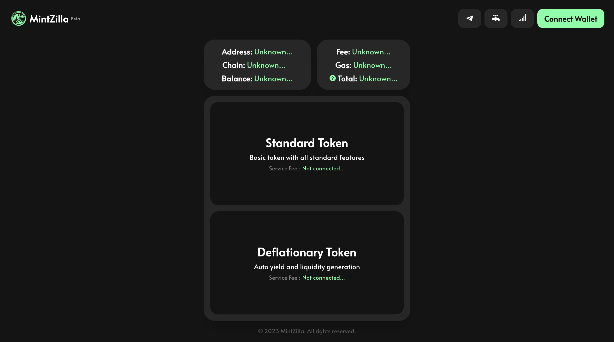

# MintZilla - No-Code ERC20 Token Creation Platform

## Overview

MintZilla enables users to create ERC20 tokens on Ethereum and other EVM-based chains without coding. Two main token types are supported: Standard and Deflationary.

## How It Works

Users connect to the platform with their Web3 wallets, select the token type, and create their tokens by specifying the token details.

## Supported Networks

- Ethereum
- Goerli Testnet
- Binance Smart Chain (BSC)
- BSC Testnet
- Polygon
- Mumbai Testnet

## Screenshots

## Test and Use

To test and use platform, visit [MintZilla](https://mintzilla.xyz) for a hands-on experience.

## Security and Performance

Our platform is built on a foundation of cutting-edge technologies aimed at bolstering security and optimizing performance. It's important to note, however, that our smart contracts have not undergone formal auditing. While we diligently review our smart contracts in alignment with industry best practices, it's crucial to recognize that there are inherent risks associated with their usage.

## FAQ

### Q1: Which wallets are supported?

A: MetaMask, Trust Wallet, and other popular injected Web3 wallets are supported.

### Q2: How is the security of created tokens ensured?

A: Tokens are created using security-focused smart contracts. You can view contracts from "contracts" folder into this repo.

### Q3: How can I distribute the tokens I create?

A: You can distribute the tokens you create directly from your wallet or through exchanges.

## Contact and Support

For questions and support requests, reach me on [Telegram](https://t.me/fullstackweb3dev).
